# Gangsta Cloud

## Introduction

A Chrome extension that lists Iranian rappers along with all of their social networks.

## Screenshot of Extension Functionality

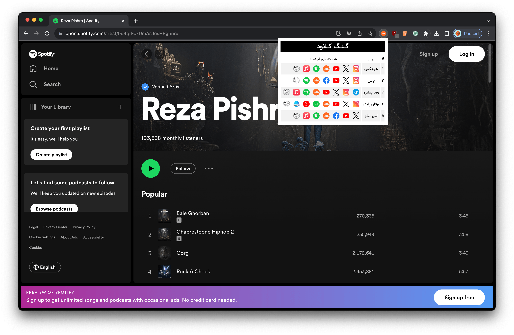

## Gallery of Listed Artists

    

        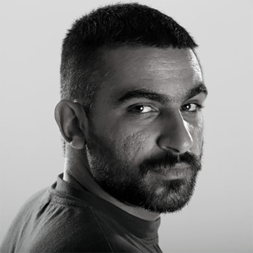
        
Hichkas

    

    

        
        
Yas

    

    

        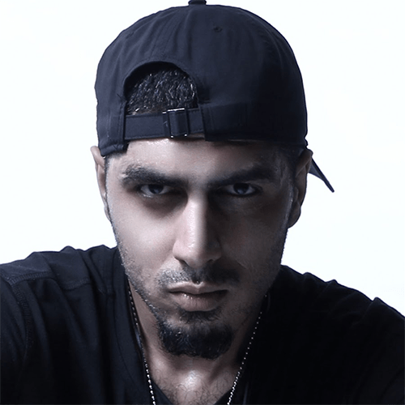
        
Reza Pishro

    

    

        
        
Erfan Paydar

    

    

        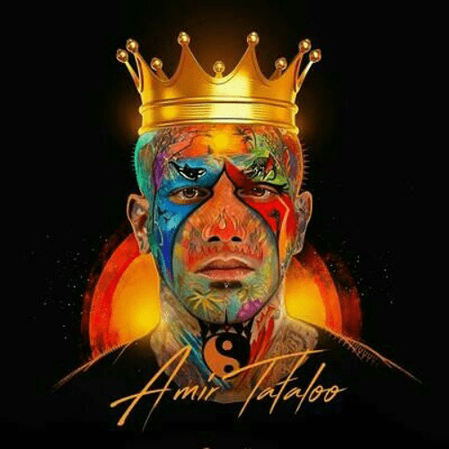
        
Amir Tataloo

    

    

        
        
Toomaj Salehi

    

    

        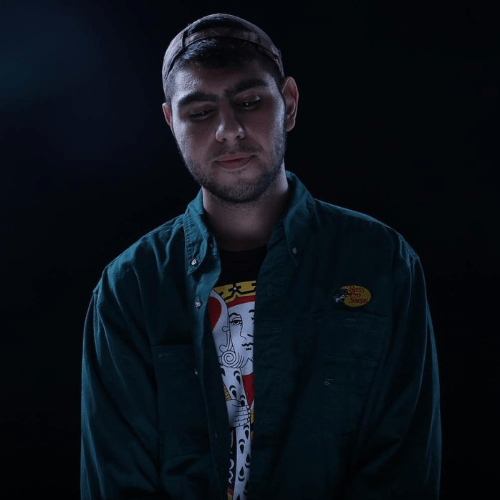
        
Omid Ghadar

    

    

        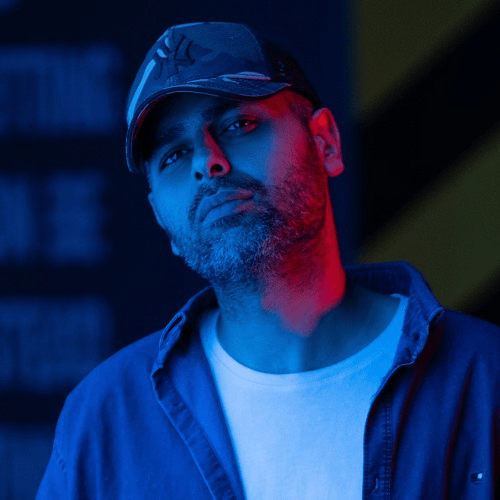
        
Ali Owj

    

    

        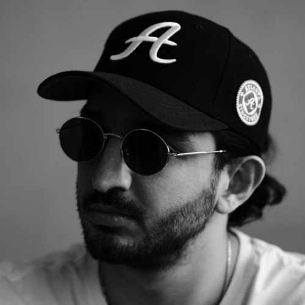
        
Sina Sae

    

    

        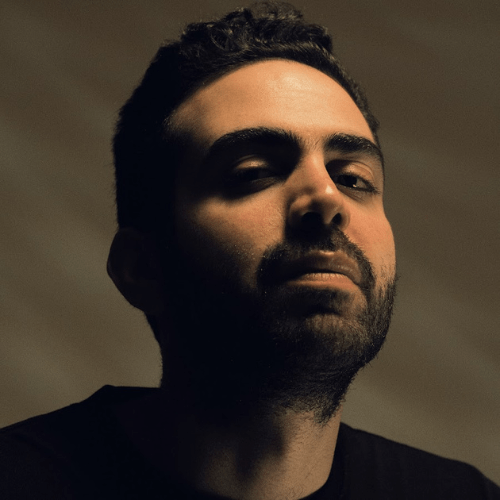
        
Bahram Nouraei

    

    

        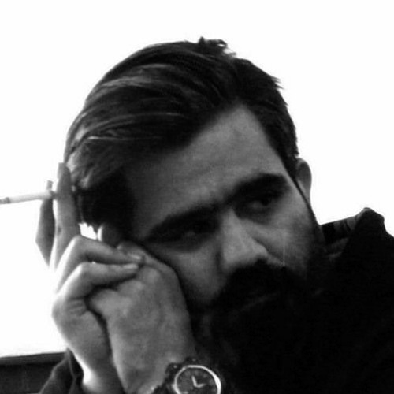
        
Ali Sorena

    

    

        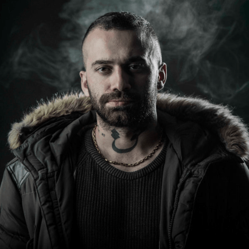
        
Amir Khalvat

    

    

        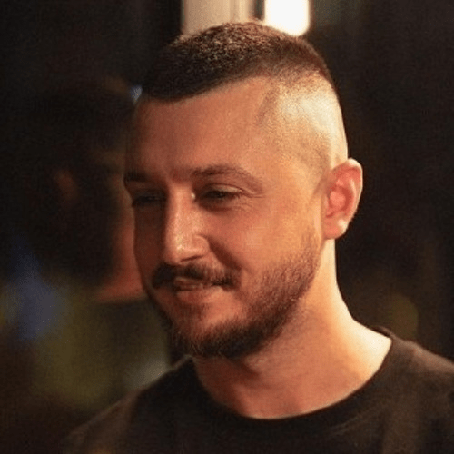
        
Mohammadreza Shayea

    

    

        
        
Shahin Najafi

    

    

        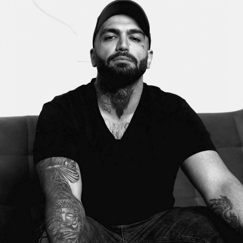
        
Ho3ein

    

    

        
        
Sadegh Vahedi

    

    

        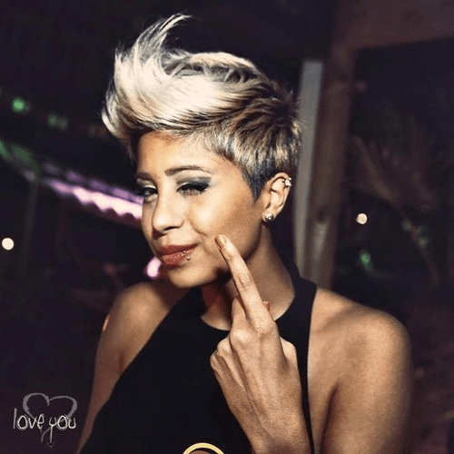
        
Sogand

    

    

        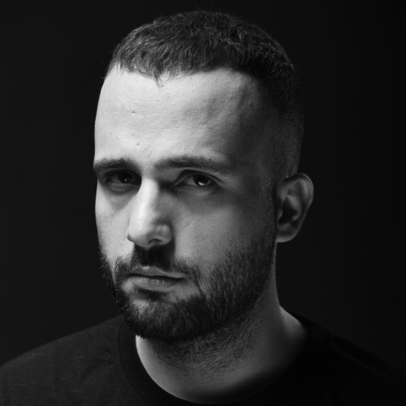
        
Daniyal

    

    

        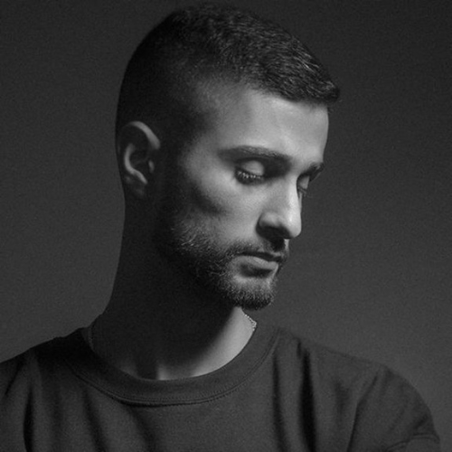
        
Sajadii

    

    

        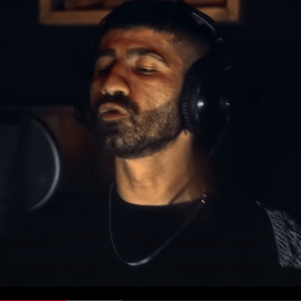
        
Meraj Tehrani

    

    

        
        
Putak

    

    

        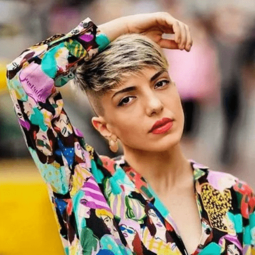
        
Justina

    

    

        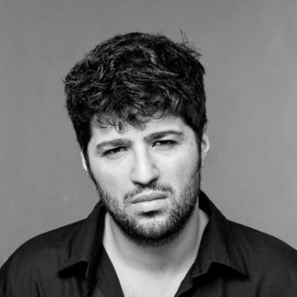
        
Moer

    

    

        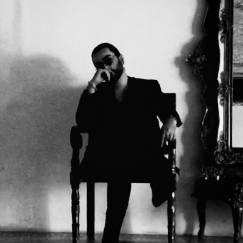
        
Sina Taham

    

    

        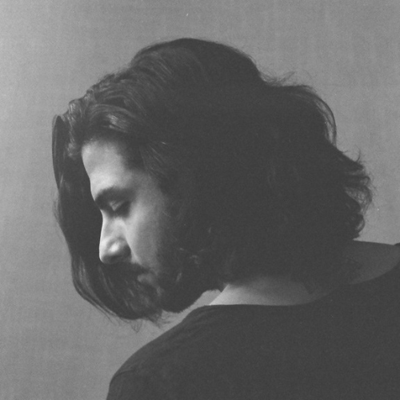
        
Mehrad Hidden

    

    <!-- Add similar blocks for each artist -->

