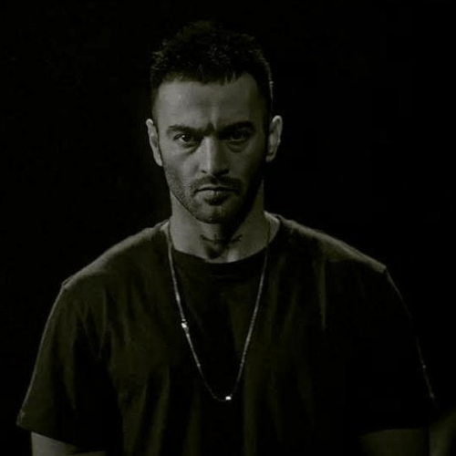

# Gangsta Cloud

## Introduction

A Chrome extension that lists Iranian rappers along with all of their social networks.

## Screenshot of Extension Functionality


## Artists added to the extension (updating)

| Name | Avatar | Social Networks |
| --- | --- | --- |
| Hichkas |  | [Install Extension](#installation-instructions) |
| Yas |  | [Install Extension](#installation-instructions) |
| Reza Pishro |  | [Install Extension](#installation-instructions) |
| Erfan Paydar |  | [Install Extension](#installation-instructions) |
| Amir Tataloo |  | [Install Extension](#installation-instructions) |
| Toomaj Salehi |  | [Install Extension](#installation-instructions) |
| Omid Ghadar |  | [Install Extension](#installation-instructions) |
| Ali Owj |  | [Install Extension](#installation-instructions) |
| Sina Sae |  | [Install Extension](#installation-instructions) |
| Bahram Nouraei |  | [Install Extension](#installation-instructions) |
| Ali Sorena |  | [Install Extension](#installation-instructions) |
| Amir Khalvat |  | [Install Extension](#installation-instructions) |
| Mohammadreza Shayea |  | [Install Extension](#installation-instructions) |
| Shahin Najafi |  | [Install Extension](#installation-instructions) |
| Ho3ein |  | [Install Extension](#installation-instructions) |
| Sadegh Vahedi |  | [Install Extension](#installation-instructions) |
| Sogand |  | [Install Extension](#installation-instructions) |
| Daniyal |  | [Install Extension](#installation-instructions) |
| Sajadii |  | [Install Extension](#installation-instructions) |
| Meraj Tehrani |  | [Install Extension](#installation-instructions) |
| Putak |  | [Install Extension](#installation-instructions) |
| Justina |  | [Install Extension](#installation-instructions) |
| Moer |  | [Install Extension](#installation-instructions) |
| Sina Taham |  | [Install Extension](#installation-instructions) |
| Mehrad Hidden |  | [Install Extension](#installation-instructions) |

## Installation Instructions

To install this Chrome extension manually, follow these steps:

1. **Download the Extension**
   - Clone this repository to your local machine using Git:
     ```
     git clone https://github.com/alihoushy/gangcloud.git
     ```
   - Alternatively, download the ZIP file of this repository and extract it to a local folder.

2. **Install the Extension**
   - Open Google Chrome.
   - Navigate to `chrome://extensions/` (you can also access this page by clicking on the Chrome menu > More Tools > Extensions).
   - Ensure that the **Developer mode** toggle in the top right-hand corner is turned on.

3. **Load the Extension**
   - Click on the **Load unpacked** button that appears.
   - In the file dialog that opens, navigate to the folder where you cloned or extracted the extension files, and select the folder.

4. **Confirm Installation**
   - The extension should now be installed and visible in your list of extensions in Chrome. You should see its icon in the Chrome toolbar if it has one.

5. **Use the Extension**
   - You can now use the extension as intended.

6. **Updating the Extension**
   - To update the extension, follow the same steps but choose the updated version of the extension folder.

### Notes:
- Make sure to reload the extension if you make changes to the code. You can do this by going back to `chrome://extensions/` and clicking the refresh icon under your extension.
- If you encounter any issues, check the Chrome Developer Documentation or open an issue in this repository.
